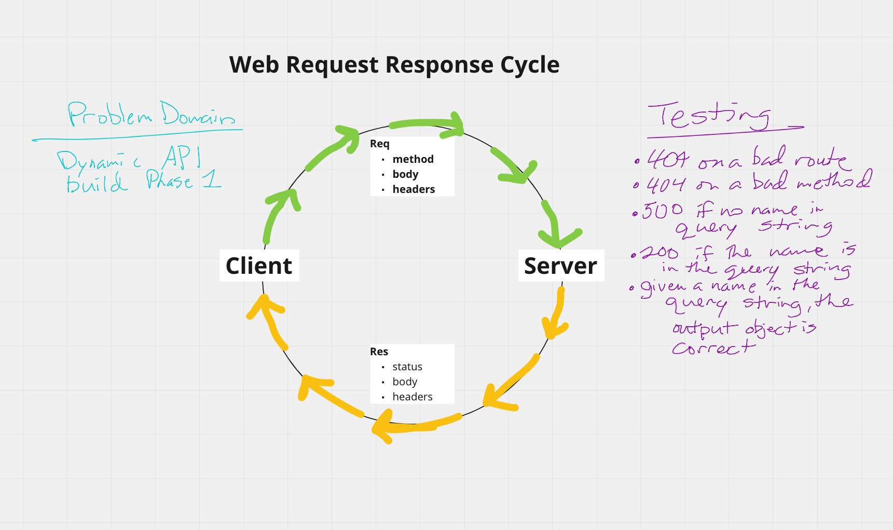

# LAB - Class 02

### Author: Dan Engel

### Links and Resources

- [ci/cd](https://github.com/daneng1/basic-express-server/actions/runs/768755104)
- [back-end server url](https://danengel-basic-express-server.herokuapp.com/)

### Setup

#### `.env` requirements (when applicable)

- `PORT` - 3333

#### How to initialize/run your application (where applicable)

- npm run start

#### Tests

- 404 on a bad route
- 404 on a bad method
- 500 if no name in the query string
- 200 if the name is in the query string
- given a name in the query string, the output object is correct

#### UML / Application Wiring Diagram

